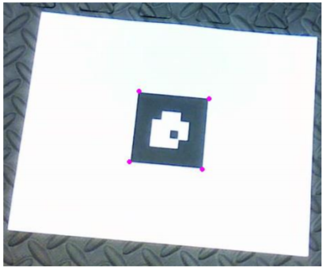
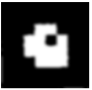
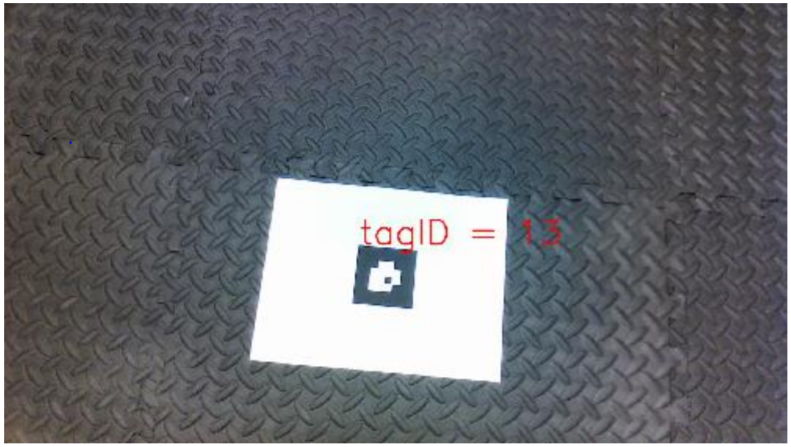
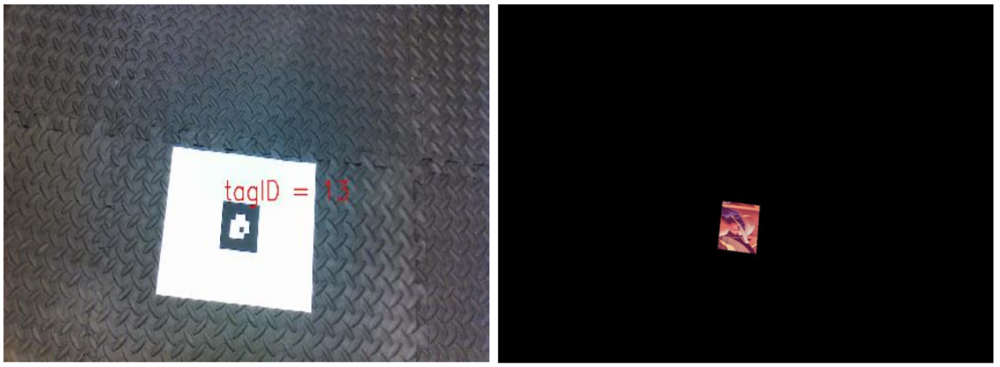
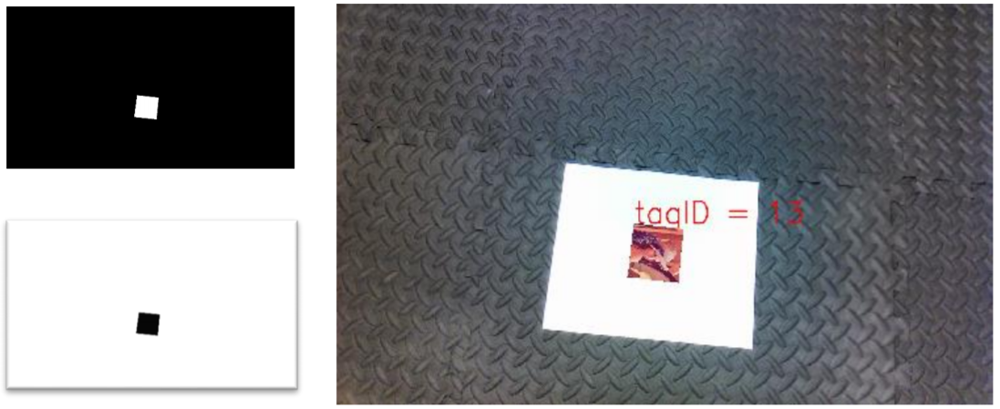
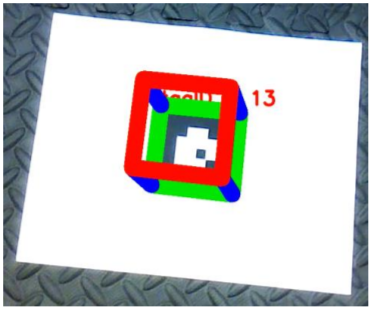

<h1 align=center> ARTag Detection and Tracking </h1>

<p align="center">


[](https://opensource.org/licenses/BSD-3-Clause)

## Overview
This project is focused on detecting a custom AR Tag (a form of fiducial marker), that is used for obtaining a
point of reference in the real world, such as in augmented reality applications.

There are two aspects to using an AR Tag, namely detection and tracking, both of which will be implemented in this project. 
The detection stage will involve finding the AR Tag from a given image sequence while the tracking stage will involve keeping the tag in “view” throughout the sequence and performing image processing operations based on the tag’s orientation and position (a.k.a. the pose).


## License
This project is under the [BSD License](https://github.com/krawal19/ARTag_detection_and_tracking/blob/master/LICENSE).

## Dependencies
The ARTag detection and Tracking package requires following dependencies.
- Python 3.5.4
- OpenCV 4.1.1

## Operation
#### The pipeline for Tag detection is as follows:
#### A) Tag corner detection
 1. Takes video as input.
 2. Convert the frame into grayscale and then binary image.
 3. Then we find the contours in the binary image.
 4. We select only those contours which has no parent contour and minimum 2 children. Thus, we get all the white papers on which the tags are printed, and this rejects the external background and all the white objects at the
 end in the video.
 5. We then select the child of the parent contour satisfying a perimeter condition which gives us the tag.
 6. We then approximate the contour points using the approxPolyDP function and tuning its epsilon. This reduces all the contours points to just 4 points which are the corners of our tag.

<p align="center">

</p>

#### B) Tag orientation detection
1. Calculate the homography matrix between the corners of the tag found in previous step and an upright position
calculated based on the width and height of the rectangle formed by the tag contour.
2. Pass this matrix to the warp function to apply the matrix to the image and make it upright.
3. Convert it to gray image and threshold it. Further we smoothen it using a blur and bilateral filter since we want
to smoothen the edges but still characteristics
4. Find the contour of this processed image and by applying approxPolyDP we are left with 4 strongest corner
points of the region containing encoding of the tag.
5. Find the distance of these 4 points from the 4 corners of the upright image and find the point with the shortest
distance which is none other the corner of the white square which denotes orientation.
6. Rotate the tag based on the position of this point in the array and make the tag upright.

<p align="center">

</p>

#### C) Tag ID detection
1. From the binary image of the upright tag in previous step calculate 4 corners of the first square of the ID
encoding region
2. Based on these 4 points calculate the intensity value of center pixel for all 4 squares and convert it into 1 or 0.
3. Then arrange this 1 or 0 from MSB to LSB and convert to decimal to calculate ID.
4. Then print the ID on the video.

<p align="center">

</p>

#### Pipeline for superimposing Image on Tag

#### A) Calculating homography matrix
1. After the tag orientation is detected we calculate the homography matrix between the 4 points of Lena’s image
(template image) and the corners of the tag detected in step 1.1.
2. Then this homography matrix is passed to the warped perspective function which sticks the transformed Lena’s
image in a black background of the size of the frame.

<p align="center">

</p>


#### B) Replace tag with lena image
1. Create a mask using the transformed image obtained above by thresholding it.
2. Inverse the mask.
3. We then take bitwise_and of the input frame and the mask inverse.
4. Further we take the bitwise_and of the transformed lena image and the mask.
5. We then add both image and finally we have an image with the tag replaced by lena

<p align="center">

</p>

#### Pipeline for superimposing Cube on Tag

#### A) Calculate projection matrix
1. We calculate the homography matrix between the 4 points of reference AR marker and the corners of the tag
detected in step 1.1.
2. Then from this homography matrix and calibration matrix we calculate r1, r2 and t. Furthermore, r3 = r1Xr2.
3. We append r1, r2, r3 and t together and form the projection matrix.

#### B) Forming Cube
1. We calculate the 4 corners of the top plane of the cube and then multiply it with the projection matrix and find
the 4 corners in the image plane.
2. We then form a contour for the bottom 4 points and the top 4 points and draw lines between them.

<p align="center">

</p>

## Instructions
```
cd src
python cube.py 
python lena.py
```
## Note
The above pipeline is developed specifically of the given videos under data folder and is not generalized.
